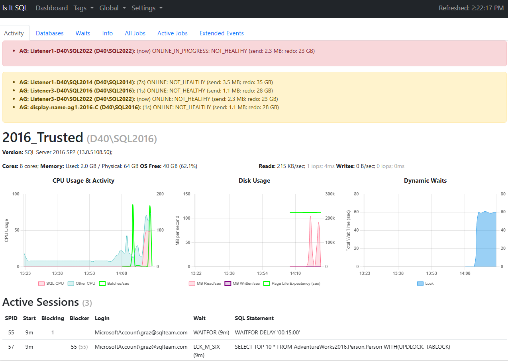

# Is It SQL
A simple SQL Server monitoring tool to determine if SQL Server is causing the current problem.

This is designed to allow a moderately technical person to determine if SQL Server is likely the cause of any current issue.  A screenshot can be sent to a Database Administrator to decide if further follow up is needed.  It runs entirely in memory and doesn't require SQL Server itself to run.  It only has a one-hour history.

## Features
* Show running sessions and any blocking
* Highlight  unreachable machines or unhealthy Availability Groups on every page
* Show CPU usage for SQL Server and other services
* Show batches per second, disk IO, and current Waits
* List databases, their size, and status
* List databases with missing backups.  This is also available as a JSON file.
* List Availability Groups and their state
* Show SQL Server Agent jobs and their status
* List recent SQL Server errors when the Extended Event session is created
* Show basic server information such as version, edition, and IP addresses
* Show database snapshots
* Show Database Mirroring status
* Download all SQL Servers to CSV showing version, edition, etc.

Please see the [Documentation](static/docs/README.md) for more details.

